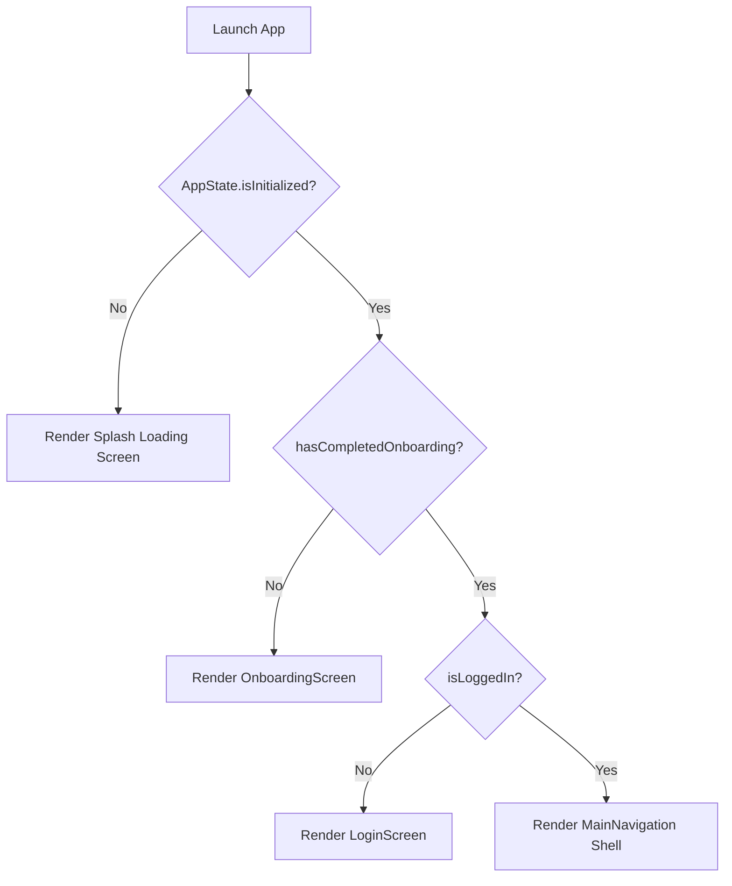

# FactShot Application Architectural Blueprint & System Specification

This document serves as the absolute, comprehensive reference manual for the **FactShot** Flutter application. It catalogs every component, class, custom widget, navigation flow, styling token, translation matrix, icon asset, state variable, and command used in the codebase.

---

## 1. Project Directory Structure

```text
factshot/
├── android/                   # Android native project configuration
├── ios/                       # iOS native project configuration
├── web/                       # Flutter Web target support
├── test/
│   └── widget_test.dart       # Widget and state initialization smoke tests
├── pubspec.yaml               # Application package manifest and dependencies
└── lib/
    ├── main.dart              # Main application bootstrapper
    ├── app/
    │   ├── app.dart           # Route coordinator and top-level MaterialApp
    │   └── app_state.dart     # Global State Management (ChangeNotifier + SharedPrefs)
    ├── data/
    │   └── models/
    │       └── article/
    │           └── article_model.dart # Article structured data model
    ├── core/
    │   ├── theme/
    │   │   └── liquid_glass_theme.dart # High-editorial visual design tokens & light/dark ThemeDatas
    │   ├── utils/
    │   │   ├── article_translations.dart # Mock Bilingual database for articles
    │   │   ├── transition_helper.dart  # Custom Cupertino-like page transitions
    │   │   └── translations.dart        # Static localization assets (UI/Buttons)
    │   └── widgets/
    │       ├── article_image/           # Premium cached image renderer
    │       ├── article_list_tile_card/  # Feed List view component
    │       ├── article_meta_row/        # Category pill and reading time bar
    │       ├── empty_state_card/        # Generic state card for empty results
    │       ├── factshot_background/     # Smooth, multi-stop gradient background
    │       ├── glass_button/            # Full-width glassmorphic CTA button
    │       ├── glass_chip/              # Interactive pill indicator
    │       ├── glass_icon_button/       # High-contrast action button
    │       ├── glass_message/           # Sleek modal top toast notification
    │       ├── glass_surface/           # Real frosted glass container (BackdropFilter)
    │       ├── glass_text_field/        # Styled input for forms and search
    │       ├── pressable_scale/         # Interactive bouncy touch wrapper
    │       └── skeleton_block/          # Loading placeholders
    └── features/
        ├── onboarding/        # First-time introductory screens
        ├── auth/              # Email, Google, Apple, and Guest authentication
        ├── shell/             # Main navigation container (Bottom bar layout)
        ├── home_feed/         # Home screen feed (Slide, Grid, List layouts + Selector Dock)
        ├── article_detail/    # Detail reader with autoplaying video, volume control & bookmarking
        ├── explore/           # Discover screen showing grid category items
        ├── search/            # Full-featured search view with recent histories
        ├── bookmarks/         # Saved article listing screen
        ├── language/          # Dedicated translation and system language configuration pages
        └── profile/           # Preferences, settings configuration, and Profile management
```

---

## 2. Global State Management (`AppState` & `AppScope`)

### Source File: `lib/app/app_state.dart`
State management leverages a single global `AppState` implementing `ChangeNotifier` bound to the widget tree using `InheritedNotifier` via the `AppScope` class. It manages persistent settings using `SharedPreferences`.

#### State Variables
| Variable Name | Type | Persistent? | Default Value | Description |
| :--- | :--- | :--- | :--- | :--- |
| `_isInitialized` | `bool` | No | `false` | Marks if `SharedPreferences` has finished loading. |
| `_hasCompletedOnboarding` | `bool` | Yes (`onboardingComplete`) | `false` | True once user completes introductory screens. |
| `_isLoggedIn` | `bool` | Yes (`isLoggedIn`) | `false` | True when the user is logged into an active session. |
| `_autoplayEnabled` | `bool` | Yes (`autoplayEnabled`) | `true` | Decides if detail screen videos start automatically. |
| `_selectedLanguage` | `String` | Yes (`selectedLanguage`) | `'English'` | Main system-wide target language. |
| `_appLanguage` | `String` | Yes (`appLanguage`) | `'English'` | Screen translations setting ('English' / 'Hindi'). |
| `_contentLanguage` | `String` | Yes (`contentLanguage`) | `'English'` | Feed content preference ('English' / 'Hindi' / 'Both'). |
| `_displayName` | `String` | Yes (`displayName`) | `'Guest'` | User profile name display. |
| `_email` | `String` | Yes (`email`) | `''` | User login email. |
| `_themeMode` | `ThemeMode` | Yes (`themeMode`) | `ThemeMode.system` | Brightness setting (`system`, `light`, `dark`). |
| `_feedMode` | `FeedMode` | Yes (`feedMode`) | `FeedMode.slide` | Layout setting (`slide`, `grid`, `list`). |
| `_notificationsEnabled`| `bool` | Yes (`notificationsEnabled`)| `true` | Decides if push notifications are allowed. |
| `_offlineReadingEnabled`| `bool` | Yes (`offlineReadingEnabled`)| `false` | Decides if local offline sync is turned on. |
| `_bookmarkedIds` | `Set<String>`| Yes (`bookmarks` mock) | `{'art-1', 'art-3'}`| Contains article IDs saved to bookmarks. |
| `_recentSearches` | `List<String>`| Yes (`recentSearches`) | Mock keywords | List of search histories. |

#### Key API Methods
* **`setLoggedIn(bool value)`**: Mutates the session state and persists to disk. Does not mutate `onboardingComplete`.
* **`setAutoplayEnabled(bool value)`**: Persists video autoplay choices.
* **`setFeedMode(FeedMode mode)`**: Persists selected Feed layout.
* **`setAppLanguage(String language)`**: Toggles app UI layout between English & Hindi.
* **`setContentLanguage(String language)`**: Sets default feed card loading language ('English', 'Hindi', or 'Both').
* **`toggleBookmark(String id)`**: Adds or removes an article ID from bookmarks.
* **`logout()`**: Sets `isLoggedIn = false`, clears profile name/email credentials, keeps onboarding status saved on mobile.

---

## 3. Application Routing and Navigation Lifecycle

### Source File: `lib/app/app.dart`
The route lifecycle manages startup redirection:



* **Splash Loading Screen**: Displays a customized `FactShotBackground` with a premium central `CupertinoActivityIndicator` (size 20) until `SharedPreferences` reads local storage.
* **Navigation Transition**: Custom slide transitions implemented using `TransitionHelper.createRoute(...)` inside `lib/core/utils/transition_helper.dart`. It matches Cupertino push transitions with an `EaseOut` curve.

---

## 4. Theme & Styling System

### Source File: `lib/core/theme/liquid_glass_theme.dart`
Contains the styling system variables. The theme is dynamic, responding to user selections and platform system changes.

#### Colors
* **Primary Accent Color**: `#5AB2FF` (Vibrant Liquid Blue)
* **Background Colors**:
  * Dark Theme: `#05070B` (Scaffold), `#0B1018` (Surface), `#101827` (Alt Card)
  * Light Theme: `#F5F7FA` (Scaffold), `#FFFFFF` (Surface), `#E2E8F0` (Alt Card)
* **Foreground Text**:
  * Dark Theme: `#F7FAFF` (Primary), `#B7C2D3` (Muted), `#7E8898` (Soft)
  * Light Theme: `#0F172A` (Primary), `#475569` (Muted), `#64748B` (Soft)
* **Borders & Outlines**: `#26FFFFFF` (Dark), `#1F000000` (Light)
* **Status Colors**: `#FF6B6B` (Error), `#67D5A5` (Success)

#### Font Typographies (using Google Fonts package)
* **`display`**: Space Grotesk Bold, 36px, height 1.0, tracking -1.4.
* **`headline`**: Space Grotesk Bold, 28px, height 1.08, tracking -0.8.
* **`title`**: Space Grotesk Bold, 20px, height 1.15, tracking -0.3.
* **`body`**: Inter Medium, 15px, height 1.45, tracking -0.15.
* **`bodyStrong`**: Inter Bold, 15px, height 1.35, tracking -0.2.
* **`caption`**: Inter Semi-Bold, 12px, height 1.3, tracking 0.12.
* **`overline`**: Inter Extra-Bold, 11px, height 1.2, tracking 1.1.

---

## 5. Main Functional Modules

### 5.1 Onboarding Module (`lib/features/onboarding/`)
Consists of `onboarding_screen.dart` representing a multi-step `PageView` walking users through FactShot's concept.
* **Layout**: Full-screen slides showing bold editorial typography, glass cards, and a page indicator.
* **Buttons**:
  * **Skip** (`CupertinoIcons.chevron_right`): Directs straight to the final step or logins.
  * **Next**: Cycles through slides.
  * **Get Started**: Calls `state.completeOnboarding()` and pushes to the login interface.

### 5.2 Authentication Module (`lib/features/auth/`)
Consists of `login_screen.dart` with various login handlers:
* **Interactive Controls**:
  * Email and Password fields (`GlassTextField`).
  * Sign In / Sign Up modes.
  * Google & Apple third-party buttons.
  * **Guest Mode Login**: Continues to the dashboard without entering credentials.
* **Action Logic**: Tapping authentication updates `state.setLoggedIn(true)` to secure the session.

### 5.3 Home Feed Module (`lib/features/home_feed/`)
Consists of `home_feed_screen.dart` which is the central workspace.

#### Layout View Modes
1. **Slide Mode (`FeedMode.slide`)**:
   * Uses a vertical page swipe (`PageView.builder` with vertical scroll direction).
   * Renders articles on full-screen cards with large visual backgrounds, a text card, and a top-right floating custom `_CardLanguageToggle` pill (toggles between **EN**, **हिंदी**, and **Both**).
2. **Grid Mode (`FeedMode.grid`)**:
   * Renders a `GridView.builder` with `SliverGridDelegateWithFixedCrossAxisCount` (crossAxisCount: 2).
   * Grid cards contain the article image, a bottom metadata section, and a small tap-sensitive language indicator pill in the metadata row.
3. **List Mode (`FeedMode.list`)**:
   * Renders a `ListView.builder` returning list items using the `ArticleListTileCard` widget.
   * Visual layout mimics typical high-editorial list indices.

#### View Mode Selector Dock (`FeedModeSelectorDock`)
Floats at `bottom: 110` (positioned cleanly above the main tab bar).
* **Blur**: Uses the updated true `BackdropFilter` glassmorphism.
* **Contrast Fix**: Active icons render `Colors.white` on top of the accent-colored selection pill. Inactive icons render dynamically (`isDark ? Colors.white54 : Colors.black45`) to guarantee visibility on light and dark backgrounds.
* **Icons**:
  * Slide Mode: `CupertinoIcons.arrow_up_down`
  * Grid Mode: `CupertinoIcons.square_grid_2x2_fill`
  * List Mode: `CupertinoIcons.list_bullet`

### 5.4 Article Detail Screen (`lib/features/article_detail/`)
Consists of `article_detail_screen.dart`, providing a clean, distraction-free reader interface.

#### Video Playback Engine
* **Source**: `video_player` plugin initializing networking links (`widget.article.videoUrl`).
* **Autoplay Setting**: Reads `AppState.instance.autoplayEnabled`. If `true`, the video is loaded, configured to loop (`setLooping(true)`), muted (`setVolume(0.0)`), and starts playing automatically. If `false`, the video remains paused.
* **Mute/Unmute Float Overlay**: Displays a single, circular glass button in the bottom right corner showing `CupertinoIcons.volume_off` (when muted) and `CupertinoIcons.volume_up` (when unmuted). Volume is updated dynamically between `0.0` and `1.0`.
* **Play/Pause Tap gesture**: Tapping anywhere on the video player area toggles the video play/pause status and triggers light haptic feedback.
* **Progress Bar**: Renders a custom colored `VideoProgressIndicator` at the bottom of the video section.

#### Other Detail View Controls
* **Language Pill Selector**: Floats at the bottom center, supporting per-article language configuration between `EN`, `हिंदी`, and `Both`.
* **Details Back Sync**: Navigator pops return the chosen local article language to synchronize feed cards with any edits.

### 5.5 Explore & Search Modules (`lib/features/explore/`, `lib/features/search/`)
* **Explore**: Renders a vertical list of categories (e.g. Science, Space, Tech) on interactive cards. Includes a top compass icon (`CupertinoIcons.compass`).
* **Search Screen**: Allows users to filter articles dynamically. Displays recent search lists with options to delete history, and handles empty state lookups cleanly.

### 5.6 Settings Profile Screen (`lib/features/profile/`)
Consists of `profile_screen.dart` representing a settings directory.
* **Autoplay Switch**: Renders a toggle tile labeled "Autoplay Videos" / "वीडियो ऑटोप्ले".
* **Language Switcher**: Action tile opening a bottom sheet to set the app interface language (English/Hindi) and content language settings (English/Hindi/Both).
* **Edit Profile**: Interactive bottom dialog sheet allowing changes to `displayName` and `email` credentials.

---

## 6. Custom Core Widgets Catalog

### 6.1 `GlassSurface` (`lib/core/widgets/glass_surface/`)
Creates a real frosted glass widget.
* **Parameters**: `Widget child`, `EdgeInsetsGeometry? padding`, `double radius`, `GlassLevel level` (`subtle`, `regular`, `strong`), `Color? customFillColor`.
* **Implementation Details**: Uses `ClipRRect` and `BackdropFilter` with `ImageFilter.blur(sigmaX: 18, sigmaY: 18)`.
* **Fills**: Adapts to dark mode (`0xC512141A`) and light mode (`0xCCF8FAFC`).

### 6.2 `PressableScale` (`lib/core/widgets/pressable_scale/`)
Creates a physics-based spring button animation.
* **Animation**: Scales down to `0.95` on press, scales back to `1.0` on release.

### 6.3 `FactShotBackground` (`lib/core/widgets/factshot_background/`)
A custom background rendering dynamic gradients.
* **Implementation**: Uses a themed linear gradient with multi-stop color placements.

### 6.4 `GlassMessage` (`lib/core/widgets/glass_message/`)
An editorial floating toast indicator.
* **Implementation**: Displays a sliding banner overlay from the top of the screen.

### 6.5 `GlassButton` & `GlassIconButton`
* **GlassButton**: Renders a full-width glass action bar.
* **GlassIconButton**: Creates circular action buttons (like bookmarks and sharing icons).

---

## 7. Bilingual UI Translation Matrix

### Source File: `lib/core/utils/translations.dart`
Contains the static UI translations key map:

| Translation Key | English Value | Hindi Value |
| :--- | :--- | :--- |
| `settings` | Settings | सेटिंग्स |
| `preferences` | Preferences | प्राथमिकताएं |
| `push_notifications` | Push Notifications | पुश सूचनाएं |
| `push_notifications_sub`| Receive daily news alerts | दैनिक समाचार अलर्ट प्राप्त करें |
| `offline_reading` | Offline Reading | ऑफ़लाइन पढ़ना |
| `offline_reading_sub` | Save articles for offline | ऑफ़लाइन के लिए लेख सहेजें |
| `account` | Account | खाता |
| `edit_profile` | Edit Profile | प्रोफाइल संपादित करें |
| `logout` | Log Out | लॉग आउट |
| `app_language` | App Language | ऐप की भाषा |
| `content_language` | Content Language | सामग्री की भाषा |
| `search_placeholder` | Search articles... | लेख खोजें... |
| `explore_categories` | Explore Categories | श्रेणियों का अन्वेषण करें |
| `bookmarks_title` | Bookmarked | बुकमार्क किए गए |

---

## 8. Build, Run, and Test Commands

Run the following standard Flutter commands in the root of the workspace directory (`/home/astern-t/Downloads/Factshot`):

* **Fetch Dependencies**:
  ```bash
  flutter pub get
  ```
* **Run in Debug Mode**:
  ```bash
  flutter run
  ```
* **Build Web target**:
  ```bash
  flutter build web --release
  ```
* **Run Widget & Smoke Tests**:
  ```bash
  flutter test
  ```

---

## 9. Comprehensive Cupertino Icon Directory

The application uses Cupertino Icons mapping standard layouts. Below is a list of the icon assets used across the modules:

* `CupertinoIcons.house` - Home tab icon.
* `CupertinoIcons.compass` - Explore tab icon.
* `CupertinoIcons.person` - Settings/Profile tab icon.
* `CupertinoIcons.arrow_up_down` - Slide layout mode.
* `CupertinoIcons.square_grid_2x2_fill` - Grid layout mode.
* `CupertinoIcons.list_bullet` - List layout mode.
* `CupertinoIcons.bell_fill` - Push notification setting tile.
* `CupertinoIcons.bolt_fill` - Offline reading setting tile.
* `CupertinoIcons.play_circle_fill` - Autoplay setting tile.
* `CupertinoIcons.globe` - Language setting tile.
* `CupertinoIcons.pencil` - Profile editing toggle.
* `CupertinoIcons.volume_off` - Player muted overlay.
* `CupertinoIcons.volume_up` - Player unmuted overlay.
* `CupertinoIcons.bookmark_fill` / `CupertinoIcons.bookmark` - Bookmarked states.
